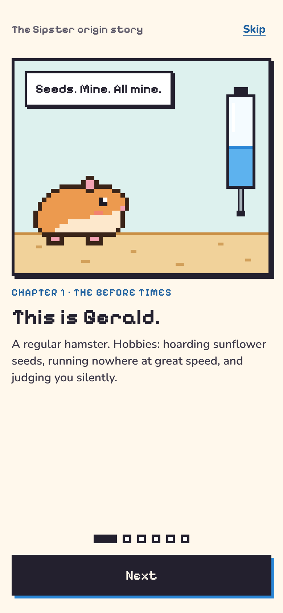
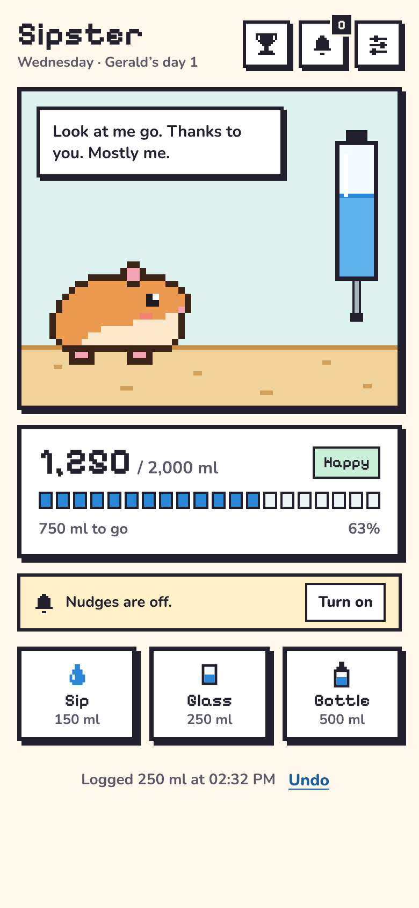
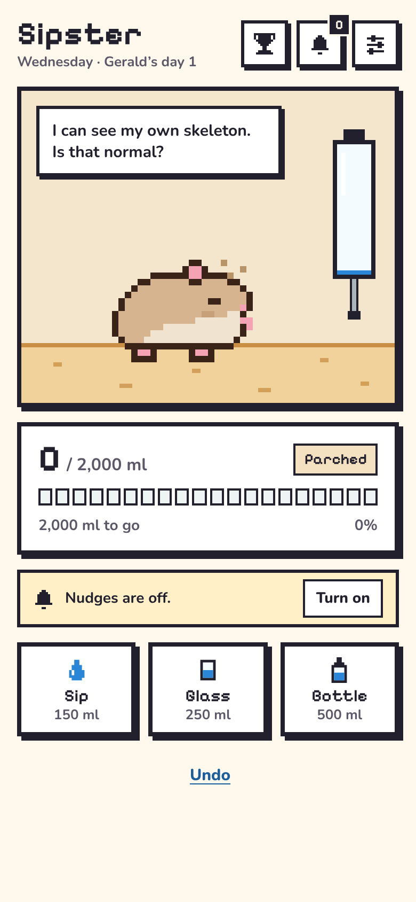
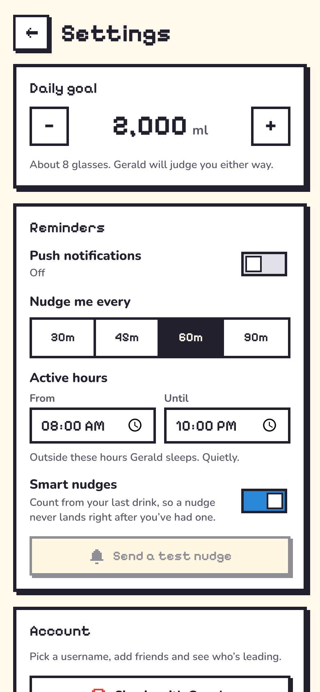

<p align="center">
  
</p>

<h1 align="center">Sipster</h1>

<p align="center">Drink water, feed Gerald.</p>

I kept forgetting to drink water. Not dramatically, just the kind where you look up at 4pm and
realise the only liquid you've had today is coffee. Every reminder app I tried, I muted within a
week. So I made one with a hamster in it. His name is Gerald. He drinks when you drink, and if
you forget him for too long he turns to dust. Turns out I'll happily ignore a notification, but I
won't let a pixel hamster die.

<p align="center">
  
  
  
  
</p>

**Try it:** [sipster.codesaif.dev](https://sipster.codesaif.dev). Install it to your home screen,
it's a PWA.

## What it does

- Tap a glass, Gerald takes a sip. Skip a few and he dries out. Overdo it and he turns into a
  water balloon.
- Nudges arrive even with the app closed. They're timed from your last drink, stay inside your
  waking hours, and stop once you've hit the day's goal.
- No account. Your drinks never leave your phone.
- Friends, if you want them. Sign in with Google, pick a username, add friends and see who's
  leading today and this week. Only daily totals go to the server, never individual drinks.
- Works as a real app on Android (install sheet) and iPhone (Add to Home Screen, with a guide).

## Run it locally

```bash
npm install
npm run vapid -- --dev-vars      # local push keys → .dev.vars
npm run db:migrate:local         # local D1 database
npm run worker:dev               # http://127.0.0.1:8787, app + API + cron
```

`npm run dev` on its own gives you hot reload on :5173 for UI work, with `/api` proxied to the
Worker if it's running. Sign-in needs a Google OAuth client in `.dev.vars`
(`.dev.vars.example` explains); without one, everything but friends works.

```bash
npm test               # unit tests + Worker tests in workerd with a real D1
npm run typecheck
```

## Under the hood

A small TypeScript PWA (Vite, hash router, IndexedDB) and a [Hono](https://hono.dev) Worker on
Cloudflare with D1. A cron trigger runs every minute and sends Web Push with VAPID and
`aes128gcm` encryption written against the RFCs, no push library. `shared/` holds the sprite,
Gerald's lines and the schedule maths both sides use.

- [docs/DEPLOY.md](docs/DEPLOY.md): your own Sipster on Cloudflare's free plan in about ten
  minutes.
- [docs/SOCIAL.md](docs/SOCIAL.md): the contract for accounts, friends, the leaderboard and
  notifications.

## Privacy

Without an account the server holds a push address, your reminder schedule and *when* you last
drank, never how much. Signed in, it also keeps your Google id, email, username, daily totals,
friendships and notifications. Deleting the account removes all of it. Gerald stays on your
phone. Full policy at [`/privacy`](https://sipster.codesaif.dev/privacy).

## License

[MIT](LICENSE)
